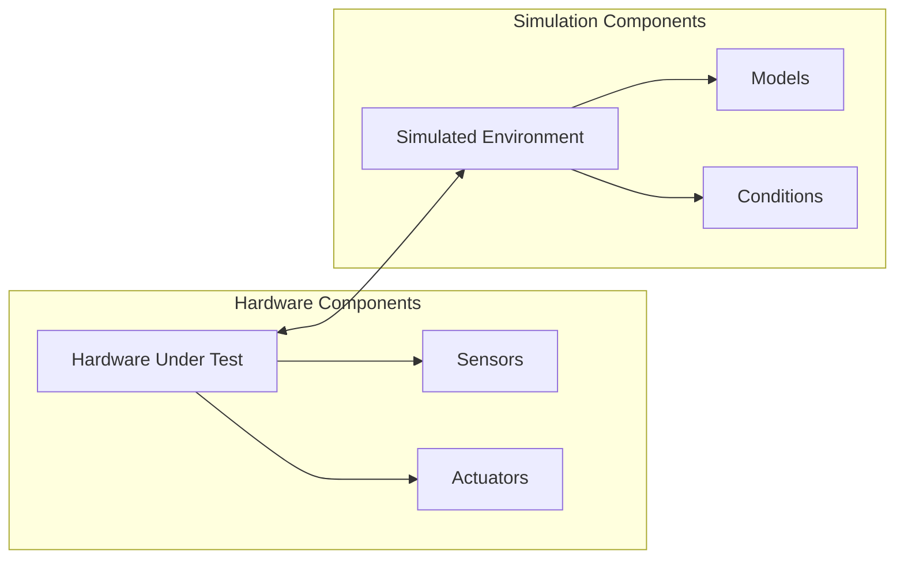

# Hardware-in-the-Loop (HIL) Testing
## Basic Concept
Hardware-in-the-Loop is a testing technique where real hardware components interact with simulated or virtual components in real-time. It creates a closed-loop system for testing embedded systems and control units.

