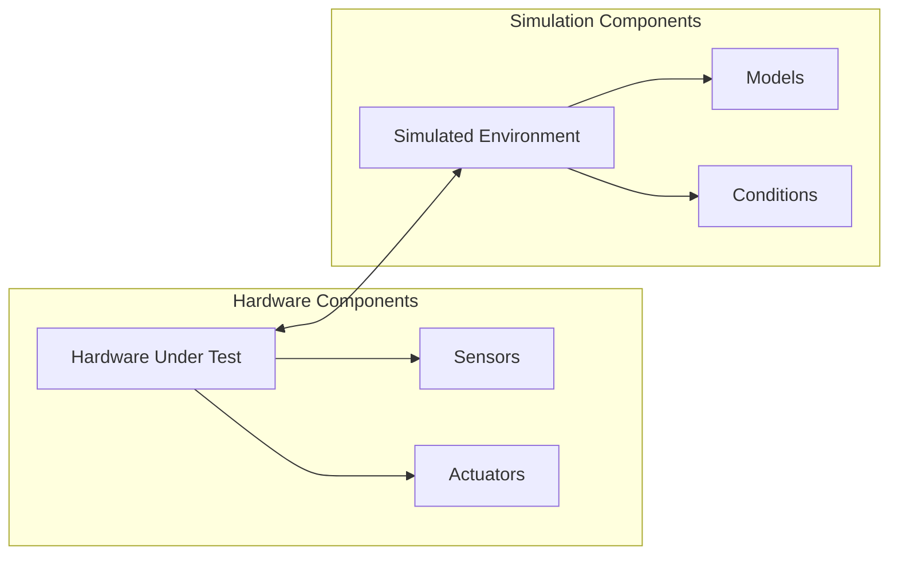

# Hardware-in-the-Loop (HIL) Testing
## Basic Concept
Hardware-in-the-Loop is a testing technique where real hardware components interact with simulated or virtual components in real-time. It creates a closed-loop system for testing embedded systems and control units.


## Key Benefits 
### 1. Risk Reduction 
```json
     benefits = {
    "safety": "Test dangerous scenarios safely",
    "cost": "Reduce physical prototype costs",
    "damage_prevention": "Prevent damage to expensive equipment",
    "repeatability": "Consistent test conditions"
}
```
### 2. Time Saving
```json
     time_savings = {
    "parallel_testing": "Multiple tests simultaneously",
    "automation": "24/7 test execution",
    "rapid_prototyping": "Quick iteration cycles",
    "regression_testing": "Automated regression suites"
}
```
## Applications
### 1. Automotive Industry
```json
     automotive_applications = {
    "engine_control": {
        "type": "ECU Testing",
        "components": ["Engine ECU", "Transmission Control", "Brake Systems"],
        "tests": ["Performance", "Safety", "Emissions"]
    },
    "ADAS": {
        "type": "Advanced Driver Assistance Systems",
        "components": ["Sensors", "Controllers", "Actuators"],
        "tests": ["Object Detection", "Emergency Braking", "Lane Keeping"]
    }
}
```
### 2. Aerospace
```json
     aerospace_applications = {
    "flight_control": {
        "systems": ["Flight Control Computer", "Navigation Systems"],
        "scenarios": ["Normal Flight", "Emergency Procedures", "System Failures"]
    },
    "engine_management": {
        "components": ["Engine Controllers", "Fuel Systems"],
        "tests": ["Performance", "Efficiency", "Safety"]
    }
}
```
### 3. Industrial Systems
```json
     industrial_applications = {
    "robotics": ["Motion Control", "Path Planning", "Safety Systems"],
    "process_control": ["PLC Testing", "SCADA Systems", "Safety Interlocks"],
    "power_systems": ["Protection Relays", "Grid Control", "Power Management"]
}
```
## HIL Testing Process
```python
     class HILTestingProcess:
    def __init__(self):
        self.stages = {
            1: "Requirements Analysis",
            2: "Test Plan Development",
            3: "Model Development",
            4: "Hardware Integration",
            5: "Test Execution",
            6: "Results Analysis"
        }
        
    def requirements_analysis(self):
        """Define test requirements and objectives"""
        requirements = {
            "functional": ["System responses", "Performance metrics"],
            "safety": ["Fault handling", "Emergency responses"],
            "performance": ["Response times", "Accuracy"]
        }
        return requirements
        
    def test_plan_development(self):
        """Create comprehensive test plan"""
        test_plan = {
            "test_cases": ["Normal operation", "Edge cases", "Fault conditions"],
            "success_criteria": ["Performance bounds", "Safety limits"],
            "test_sequence": ["Initialization", "Execution", "Verification"]
        }
        return test_plan
        
    def model_development(self):
        """Develop simulation models"""
        models = {
            "plant_model": "System dynamics simulation",
            "sensor_models": "Sensor behavior simulation",
            "actuator_models": "Actuator response simulation"
        }
        return models
```
